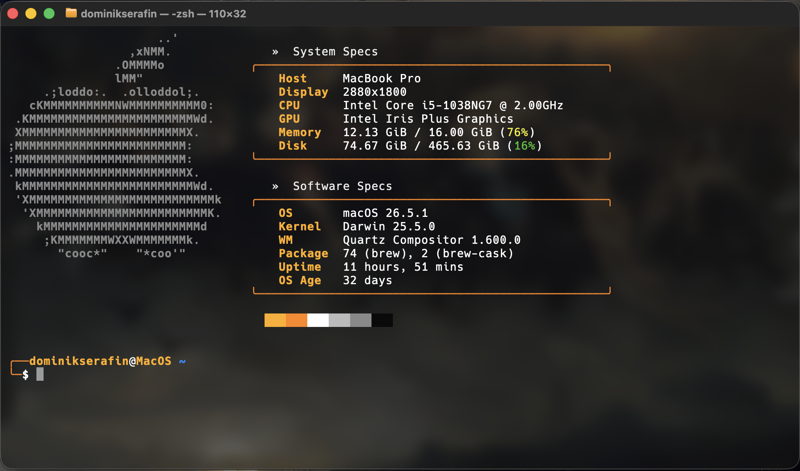

🇬🇧 English | [🇵🇱 Polski](README.pl.md)

# better-macos-terminal

macOS terminal setup with a JJK theme — custom zsh prompt, fastfetch with ASCII Apple logo and a two-section specs layout.



## Prerequisites

- **macOS** with the default **Terminal.app**
- **Homebrew** — https://brew.sh (the installer will check for it)
- **Nerd Font set manually** in Terminal.app after installation:
  `Terminal → Settings → Profiles → Font → Hack Nerd Font`

## Installation

```bash
git clone https://github.com/dominikx2002/better-macos-terminal.git
cd better-macos-terminal
./install.sh
```

The script handles everything automatically:

1. Checks for Homebrew (exits with a message if missing)
2. Installs via brew: `fastfetch`, `chafa`, `imagemagick`, `zsh-autosuggestions`, `zsh-syntax-highlighting`, `font-hack-nerd-font`
3. Copies `config.jsonc` and `launch.sh` to `~/.config/fastfetch/`
4. **Backs up** your current `~/.zshrc` → `~/.zshrc.backup.YYYYMMDDHHMMSS` (never overwrites without a backup)
5. Creates a symlink `~/.zshrc → <repo>/dotfiles/zshrc`

After installation run `source ~/.zshrc` or open a new terminal.

> **Safe to re-run** — running `./install.sh` again skips already-installed packages and refreshes the symlink without creating unnecessary backups.

## Autostart

Fastfetch launches automatically on every new terminal session — via a block at the end of `dotfiles/zshrc` that calls `~/.config/fastfetch/launch.sh` only when the shell is interactive and attached to a TTY (does not run inside scripts or pipes).

## Repo structure

```
config.jsonc          — fastfetch configuration
launch.sh             — script that runs fetch (copied to ~/.config/fastfetch/)
dotfiles/
  zshrc               — zsh configuration (symlinked as ~/.zshrc)
images/               — optional custom logo images
install.sh            — installer
```
