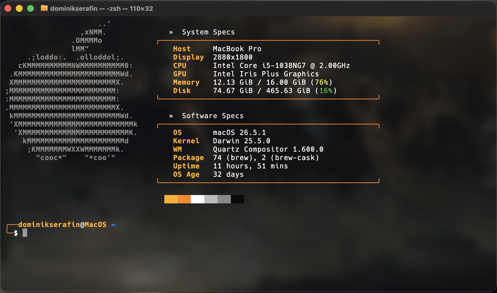

[🇬🇧 English](README.md) | 🇵🇱 Polski

# better-macos-terminal

Konfiguracja terminala macOS z motywem JJK — niestandardowy prompt zsh, fastfetch z ASCII logo Apple i dwusekcyjnym layoutem specyfikacji.



## Wymagania wstępne

- **macOS** z domyślnym **Terminal.app**
- **Menedżer pakietów** — instalator wybierze go automatycznie:
  - **Mac z Intelem → [MacPorts](https://www.macports.org/install.php)** (zalecane). Od Homebrew 7.0 Intel jest w Tier 3: brak nowych bottles, koniec wsparcia we wrześniu 2027. Zainstaluj `xcode-select --install`, potem `.pkg` dla swojej wersji macOS (np. *Sequoia*).
  - **Apple Silicon → [Homebrew](https://brew.sh)**
- **Nerd Font ustawiony ręcznie** w Terminal.app po instalacji:
  `Terminal → Ustawienia → Profile → Czcionka → Hack Nerd Font`

## Instalacja

```bash
git clone https://github.com/dominikx2002/better-macos-terminal.git
cd better-macos-terminal
./install.sh              # automatyczny wybór
./install.sh --macports   # wymuś MacPorts
./install.sh --brew       # wymuś Homebrew
```

Skrypt zrobi wszystko automatycznie:

1. Wykrywa menedżer pakietów: Homebrew na Apple Silicon, w pozostałych przypadkach MacPorts (przerwie z instrukcją, jeśli brak obu)
2. Instaluje `fastfetch`, `zsh-autosuggestions`, `zsh-syntax-highlighting` i **Hack Nerd Font** (cask Homebrew albo pobranie z [nerd-fonts](https://github.com/ryanoasis/nerd-fonts) do `~/Library/Fonts` przy MacPorts — MacPorts poprosi o hasło `sudo`)
3. Kopiuje `config.jsonc` i `launch.sh` do `~/.config/fastfetch/`
4. **Robi kopię zapasową** aktualnego `~/.zshrc` → `~/.zshrc.backup.YYYYMMDDHHMMSS` (nigdy nie nadpisuje bez backupu)
5. Tworzy symlink `~/.zshrc → <repo>/dotfiles/zshrc`

Po instalacji uruchom `source ~/.zshrc` lub otwórz nowy terminal.

> **Bezpieczne do wielokrotnego uruchomienia** — ponowne `./install.sh` pomija już zainstalowane pakiety i odświeża symlink bez zbędnych backupów.

## Autostart

Fastfetch uruchamia się automatycznie przy każdym otwarciu nowego terminala — dzięki blokowi na końcu `dotfiles/zshrc`, który wywołuje `~/.config/fastfetch/launch.sh` tylko gdy powłoka jest interaktywna i podłączona do TTY (nie odpala się w skryptach ani pipe'ach).

## Struktura repo

```
config.jsonc          — konfiguracja fastfetch
launch.sh             — skrypt uruchamiający fetch (kopiowany do ~/.config/fastfetch/)
dotfiles/
  zshrc               — konfiguracja zsh (symlinked jako ~/.zshrc)
images/               — opcjonalne własne obrazy logo
install.sh            — instalator
```
